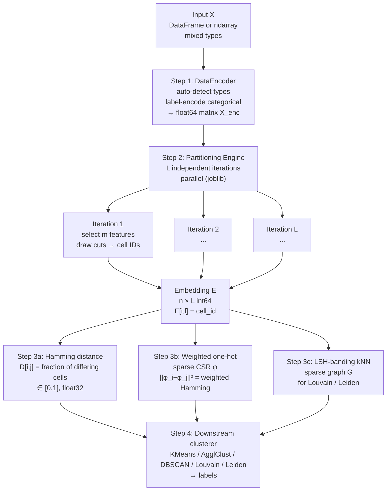
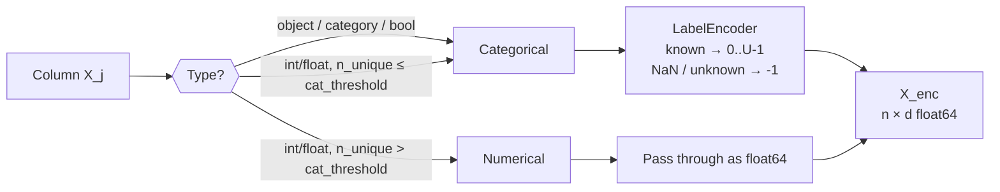
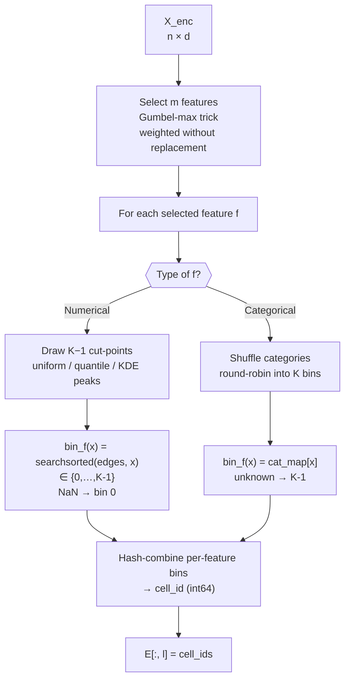
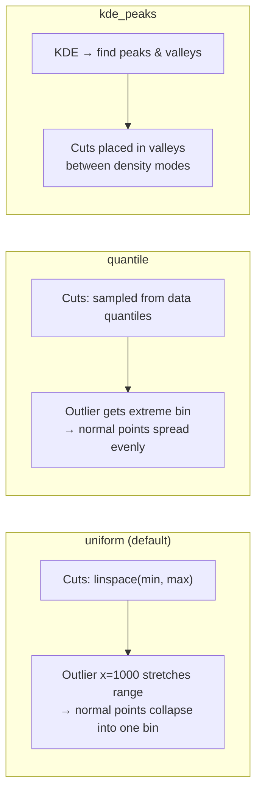
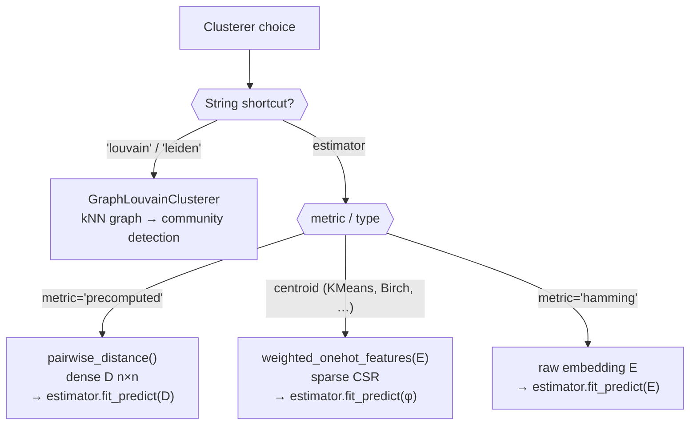
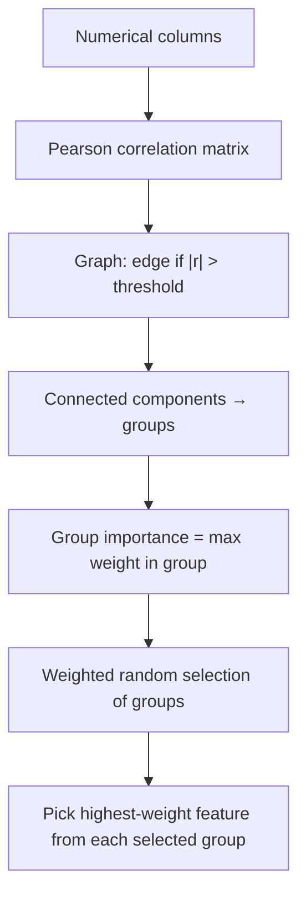
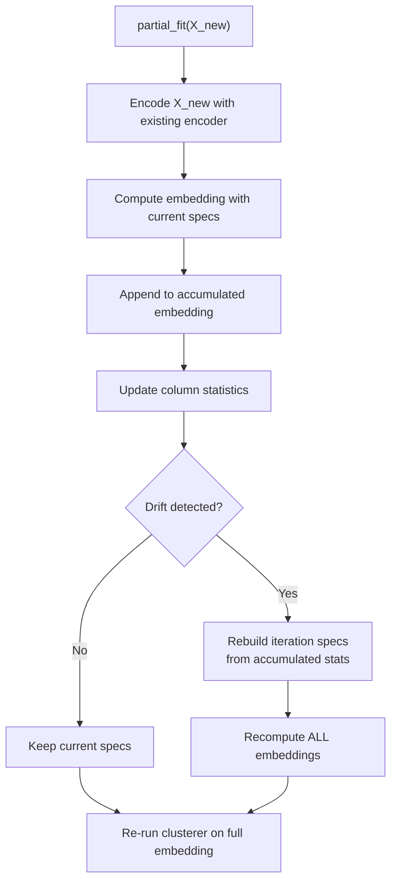
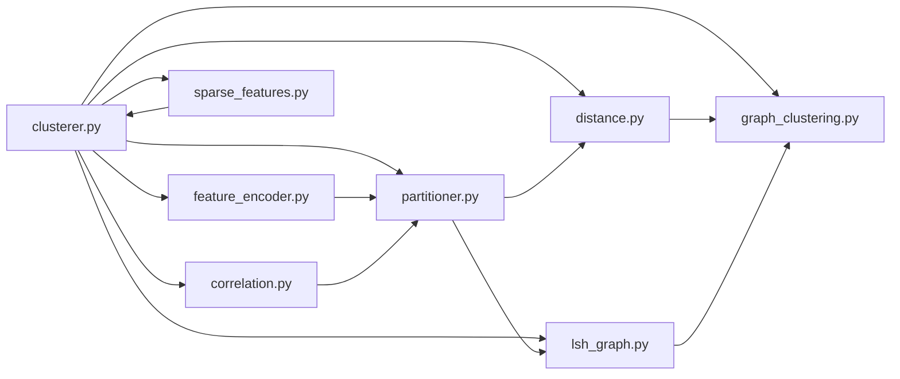

# ForestClustering: Algorithm & Architecture

> Document version matches `forest_clustering` **0.4.0**.

---

## Contents

1. [Architecture overview](#1-architecture-overview)
2. [Step 1 — Feature Encoding](#2-step-1--feature-encoding)
3. [Step 2 — Random Partitioning & Embedding](#3-step-2--random-partitioning--embedding)
   - [One iteration](#31-one-iteration)
   - [Cell-ID hashing](#32-cell-id-hashing)
   - [The n×L embedding matrix](#33-the-nl-embedding-matrix)
   - [Cut-point strategies](#34-cut-point-strategies)
4. [Step 3 — Distance & Similarity](#4-step-3--distance--similarity)
5. [Step 4 — Downstream Clustering](#5-step-4--downstream-clustering)
6. [Advanced mechanisms](#6-advanced-mechanisms)
   - [Adaptive bins](#61-adaptive-bins)
   - [Correlation-aware selection](#62-correlation-aware-selection)
   - [Iteration weighting](#63-iteration-weighting)
   - [Contrastive trees](#64-contrastive-trees)
   - [LSH-banding kNN graph](#65-lsh-banding-knn-graph)
7. [Online / incremental mode](#7-online--incremental-mode)
8. [Code map](#8-code-map)

---

## 1. Architecture overview



**Key invariant:** the dense `n × n` distance matrix is **never materialised** for large `n`. The `n × L` embedding (`L ≈ 200`) is the only compact representation kept in memory.

---

## 2. Step 1 — Feature Encoding

`DataEncoder` (`feature_encoder.py`) inspects each column and decides whether it is **numerical** or **categorical**.



| Behaviour | Numerical | Categorical |
|---|---|---|
| `fit_transform` | values preserved | label-encoded to `0 … U-1` |
| `transform` (new data) | values preserved | unknown category → `-1` |
| NaN | preserved as NaN | mapped to `-1` |
| Override | `feature_types={col: "numerical"}` | `feature_types={col: "categorical"}` |

**Smart auto-detection** (`auto_feature_types='smart'`):
* datetime → numerical (timestamp)
* integer with ID-like name (`_id`, `user_id`, …) and high cardinality → numerical
* low-cardinality integer → categorical
* float values that are actually integers (`1.0, 2.0`) → categorical if cardinality is low

---

## 3. Step 2 — Random Partitioning & Embedding

### 3.1 One iteration

Each of the `L` iterations is independent.



**Feature selection.** `m` is controlled by `n_features`:
* `"sqrt"` → `ceil(sqrt(d))`
* `"log2"` → `ceil(log2(d))`
* `int` → fixed count
* `float` → fraction of `d`

The **Gumbel-max trick** implements weighted sampling without replacement in `O(d)`:

```
score_j = log(weight_j) + Gumbel(0,1)
select top-m scores
```

### 3.2 Cell-ID hashing

A cell is a tuple of bins `(b₁, b₂, …, b_m)`. Instead of a mixed-radix positional code (which overflows `int64` when `m·log₂(K) > 63`), the implementation uses a **64-bit FNV-1a style hash-combine**:

```python
HASH_INIT  = 1469598103934665603   # FNV-1a offset basis
HASH_GOLDEN = 0x9E3779B97F4A7C15   # 2^64 / φ

h = HASH_INIT
for each bin b in (b1, b2, ..., bm):
    h = h ^ (b + HASH_GOLDEN + (h << 6) + (h >> 2))

cell_id = h & ((1 << 52) - 1)      # mask to 52 bits
```

**Why 52 bits?** `float64` has 53 bits of mantissa. Masking to 52 guarantees that every `cell_id` is **exactly representable** as `float64`. This matters because `scipy.spatial.distance.cdist` casts the embedding to double; full-range `int64` ids would collide silently and zero out the distance matrix.

The hash is a pure function of the bin tuple, so the same tuple always maps to the same id on training and new data (out-of-sample consistency).

### 3.3 The n×L embedding matrix

After `L` iterations each point is described by a vector of cell ids:

```
          iter_0   iter_1   iter_2  …  iter_{L-1}
point_0 [   11       24        3    …      7    ]
point_1 [   11        5        3    …     42    ]
point_2 [    7       24       18    …      7    ]
point_3 [    3        5        9    …     42    ]
```

*Points 0 and 1* matched in iterations 0 and 2 → they are similar under these random projections. Hamming distance simply counts how many iterations they **did not** match.

### 3.4 Cut-point strategies

Three strategies are available for numerical features.

| Strategy | Mechanism | When to use |
|---|---|---|
| **uniform** (default) | `rng.uniform(min, max, size=K-1)` | Fast, no outliers |
| **quantile** | random sample from empirical quantiles | Outlier-robust |
| **kde_peaks** | detect valleys between KDE peaks, place cuts there | Density-aware, multimodal data |



**KDE peaks** (`kde_cuts.py`) workflow:
1. Subsample large columns (>10 000 rows).
2. Estimate bandwidth (Silverman / Scott rule, clamped to `range × 1e-4`).
3. Evaluate Gaussian KDE on a grid.
4. Find peaks with `scipy.signal.find_peaks`.
5. Reject flat KDEs (guard against sampling noise).
6. Select valleys by depth + balance score.
7. Fall back to uniform if not enough valleys are found.

---

## 4. Step 3 — Distance & Similarity

### Hamming distance

```
D[i,j] = (1/L) · Σ_l 1{ E[i,l] ≠ E[j,l] }   ∈ [0, 1]
```

Implementation uses `scipy.spatial.distance.cdist(..., metric='hamming')`. For `n > 2000` a chunked variant builds the matrix row-by-row to limit memory.

### Weighted Hamming

When `iteration_weighting` is `"entropy"` or `"inverse_gini"`, each iteration `l` receives a weight `w_l` (mean-normalised to 1.0):

```
D_weighted[i,j] = Σ_l w_l · 1{ E[i,l] ≠ E[j,l] } / Σ_l w_l
```

* **entropy** — rewards iterations with high cell-diversity (high Shannon entropy).
* **inverse_gini** — rewards iterations with balanced cell sizes (low Gini inequality).
* **temperature** — `T < 1` sharpens differences, `T > 1` softens them.

Fast paths: `numba` parallel kernels, or cache-friendly chunked numpy with `joblib` threading.

### Sparse weighted one-hot features

For centroid estimators (KMeans, MiniBatchKMeans, Birch) the embedding is expanded into a **sparse CSR matrix** with exactly `L` non-zeros per row:

```python
# For iteration l with weight w_l and cell c:
phi[i, offset_l + c] = sqrt(w_l / 2)
```

Then:

```
||phi_i - phi_j||² = Σ_l w_l · 1{E[i,l] ≠ E[j,l]} = weighted Hamming
```

This makes KMeans optimise a weighted-Hamming-consistent objective while staying `O(n·L)` in memory, regardless of per-column cardinality.

---

## 5. Step 4 — Downstream Clustering

`ForestClusterer` automatically routes the embedding to the clusterer in the correct format:



| Algorithm | Input format | Best for |
|---|---|---|
| KMeans / MiniBatchKMeans / Birch | sparse weighted one-hot `φ` | Known `K`, any `n` |
| AgglomerativeClustering (`precomputed`) | dense Hamming matrix `D` | Non-spherical, `n ≤ 12 000` |
| DBSCAN (`metric='hamming'`) | raw embedding `E` | Unknown `K`, noise |
| Louvain / Leiden | LSH-banding kNN graph | Large `n`, no `K` needed |

**Size-aware routing.** For `n ≤ 12 000` the Louvain/Leiden path uses the exact dense Hamming matrix (classic behaviour, exact tie-breaking). For `n > 12 000` it switches to the **matrix-free LSH-banding kNN graph** so `O(n²)` memory is never allocated.

---

## 6. Advanced mechanisms

### 6.1 Adaptive bins

Instead of a fixed `K` for all features, `adaptive_bins=True` computes per-feature bin counts from column statistics:

```python
# Score components:
c_spread = IQR / range          # how spread out is the data?
c_unique = n_unique / (2·sqrt(n))  # cardinality signal

C = 0.5·c_spread + 0.5·c_unique   # composite score ∈ [0,1]
K_j = round(min_bins + (max_bins - min_bins) · C)
```

Categorical features automatically get `K_j = clip(n_unique, min_bins, B_max)` where `B_max = min(max_bins, Sturges(n))`.

### 6.2 Correlation-aware selection

Two layers of correlation handling exist:

1. **Feature weights** (`corr_threshold`): strongly correlated features get weight `1/G` where `G` is group size. This reduces selection probability but does not forbid co-selection.
2. **Correlation-aware selection** (`correlation_aware=True`): at most **one** feature per correlated group is selected in a single iteration. This guarantees diversity within each random partition.



### 6.3 Iteration weighting

After the embedding is built, each iteration is scored by the uniformity of its cell-size distribution:

* **entropy** — `w_l ∝ H(cell_distribution) / log(n_unique)`
* **inverse_gini** — `w_l ∝ Gini_uniformity / Gini_max`

Iterations that split data into a few giant cells (low information) receive near-zero weight; iterations with fine, balanced splits receive high weight.

### 6.4 Contrastive trees

When `contrastive=True`, each iteration builds a small decision tree (max depth ≈ `max(3, n_bins)`) optimised with a contrastive loss:

1. Run KMeans on the node to get pseudo-labels.
2. Generate positive pairs (same label) and negative pairs (different labels).
3. At each split, evaluate:
   ```
   score = -contrastive_loss + 0.1 · information_gain
   ```
4. The tree structure is stored (not just leaf ids), so `transform()` on new data is consistent.

This learns partitions that separate known pseudo-clusters rather than cutting randomly.

### 6.5 LSH-banding kNN graph

For large `n` the exact `n × n` distance matrix is infeasible. The LSH-banding graph builder (`lsh_graph.py`) works directly on the embedding:

1. **Compact codes** — factorise each column to the smallest `uint8/16/32` dtype preserving equality.
2. **Banding** — split `L` columns into bands of size `r`. Rows sharing the exact same tuple in a band are candidate neighbours.
3. **Vectorised pair enumeration** — within each bucket, all `i < j` pairs are generated via a closed-form triangular inverse (no Python loops).
4. **Exact Hamming on candidates** — compute true distance only for candidates.
5. **Per-row top-k** — a single packed-key `argsort` keeps the `k` nearest neighbours per row.

Memory is `O(n·c)` where `c` is the candidate count, never `O(n²)`. `band_size='auto'` picks the smallest band size that keeps collision load bounded.

---

## 7. Online / incremental mode

`partial_fit` allows the clusterer to ingest new data without a full refit:



Drift is measured per-feature as `max(|Δmean|, |Δstd|) / std_ref`. If the fraction of drifted features exceeds `partial_fit_rebuild_threshold`, the specs are rebuilt. The accumulated data is capped to `partial_fit_max_samples` to prevent unbounded growth.

---

## 8. Code map

```
forest_clustering/
├── __init__.py               # public exports
├── clusterer.py              # ForestClusterer (fit, partial_fit, transform, …)
├── transformer.py            # ForestTransformer (sklearn TransformerMixin)
├── partitioner.py            # build_iteration_specs, compute_embedding, _cell_ids
├── feature_encoder.py        # DataEncoder, auto type detection
├── correlation.py            # Spearman-based feature weighting
├── correlation_aware.py      # group building & correlation-aware selection
├── adaptive_bins.py          # per-feature optimal bin counts
├── kde_cuts.py               # density-aware cut-point generation
├── distance.py               # pairwise Hamming (exact & chunked)
├── weighted_distance.py      # weighted Hamming + numba fast paths
├── iteration_weights.py      # entropy / inverse-gini weighting
├── sparse_features.py        # weighted one-hot CSR for centroid clusterers
├── graph_clustering.py       # GraphLouvainClusterer (Louvain & Leiden)
├── lsh_graph.py              # batched Hamming kNN + LSH banding kNN
├── contrastive_splits.py     # contrastive tree fitting
├── permutation_importance.py # feature importance via permutation
├── preflight.py              # Hopkins, Gap, clusterability_test
└── significance.py           # ARI permutation, bootstrap CI, silhouette sig
```


