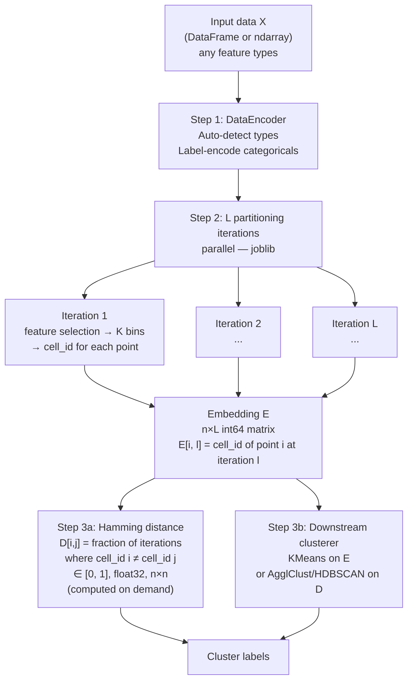
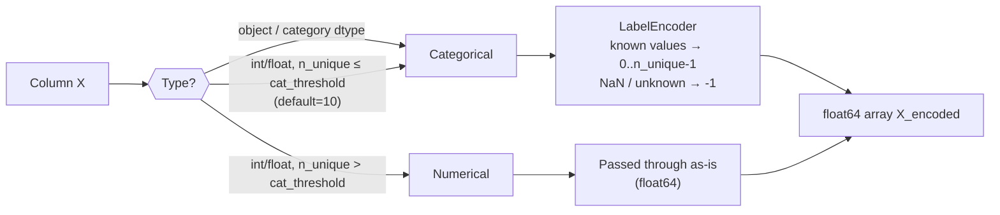
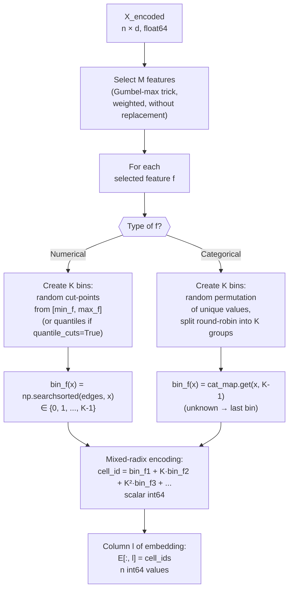
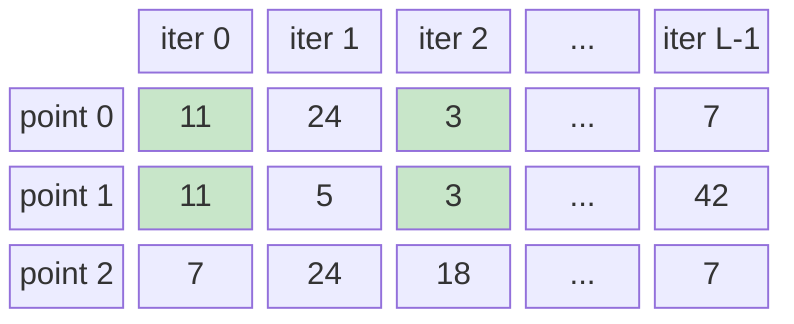
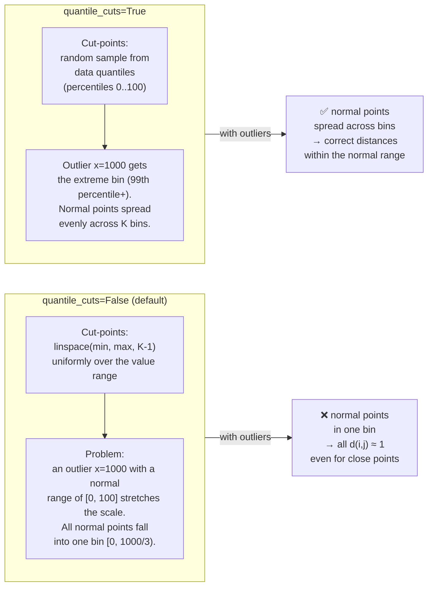
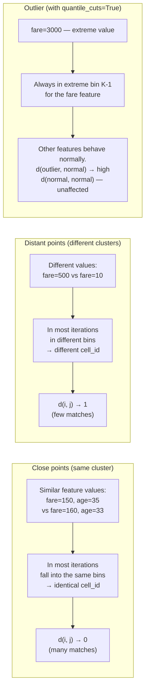
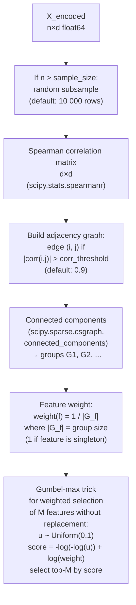
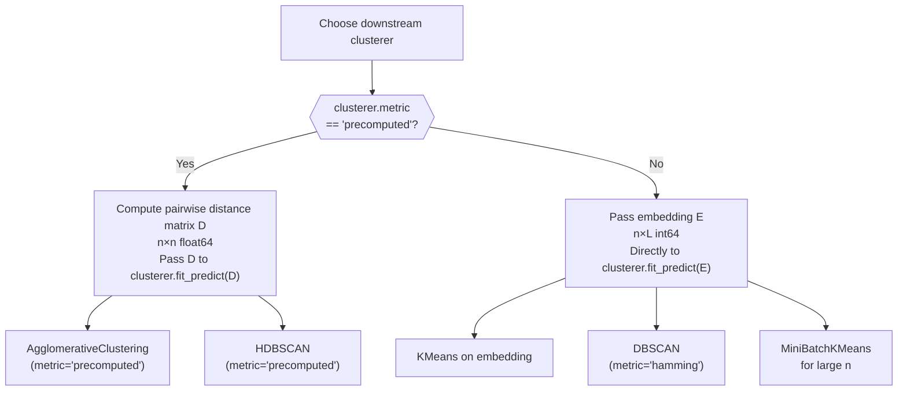
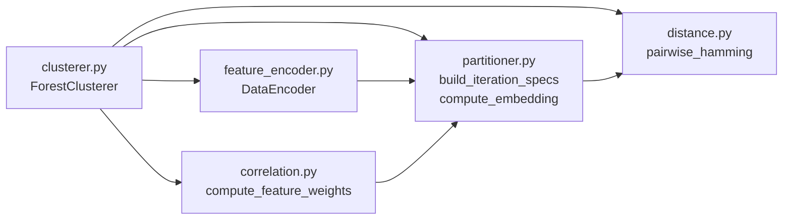

# ForestClustering: how the algorithm works

> Document version matches the implementation in `forest_clustering/`.

---

## Contents

1. [Overview: three steps](#1-overview-three-steps)
2. [Step 1 — Feature encoding](#2-step-1--feature-encoding)
3. [Step 2 — Building the embedding](#3-step-2--building-the-embedding)
   - [One partitioning iteration](#31-one-partitioning-iteration)
   - [Mixed-radix cell encoding](#32-mixed-radix-cell-encoding)
   - [The n×L embedding matrix](#33-the-nl-embedding-matrix)
   - [Uniform vs quantile cut-points](#34-uniform-vs-quantile-cut-points)
4. [Step 3 — Distance estimation (Hamming)](#4-step-3--distance-estimation-hamming)
   - [Why it works](#41-why-it-works)
5. [Correlated-feature weighting](#5-correlated-feature-weighting)
6. [Downstream algorithm recommendations](#6-downstream-algorithm-recommendations)
7. [Parameters and tuning](#7-parameters-and-tuning)
8. [Code structure](#8-code-structure)

---

## 1. Overview: three steps

ForestClusterer builds a similarity measure between observations through **repeated random partitioning** of the feature space — analogous to IsolationForest, but instead of tree depth it counts how often pairs of points fall into the same "cell".



**Key property**: the explicit n×n distance matrix is **not stored in memory** during training. The n×L embedding is a compact enough representation from which distances are computed on demand.

---

## 2. Step 1 — Feature encoding

`DataEncoder` (`feature_encoder.py`) automatically determines the type of each feature and converts the data to a uniform float64 array.



| Behaviour | Numerical | Categorical |
|-----------|-----------|-------------|
| fit_transform | values preserved | LabelEncoder → 0..n-1 |
| transform (new data) | values preserved | unknown category → -1 |
| NaN | preserved as NaN | → -1 |
| `feature_types_override` | type can be forced | type can be forced |

> **Why**: categorical features are partitioned differently from numerical ones. `DataEncoder` ensures that `partitioner.py` knows the type of every column.

---

## 3. Step 2 — Building the embedding

### 3.1 One partitioning iteration

Each of the L iterations is independent. In each iteration:



**Number of features M** is controlled by the `n_features` parameter:
- `'sqrt'` → `ceil(sqrt(d))`
- `'log2'` → `ceil(log2(d))`
- `int` → fixed count
- `float` → fraction of d

### 3.2 Mixed-radix cell encoding

A cell is a tuple of bins `(bin_f1, bin_f2, ..., bin_fM)`, packed into a single int64 via a mixed-radix scheme (analogous to representing a number in base K):

```
cell_id = bin_f1 + K·bin_f2 + K²·bin_f3 + ... + K^(M-1)·bin_fM
```

**Example**: K=3, M=3 features, bins = (2, 0, 1)

```
cell_id = 2 + 3·0 + 9·1 = 11
```

| M | K | Unique cells | int64 range |
|---|---|--------------|-------------|
| 3 | 3 | 27 | 0–26 |
| 4 | 3 | 81 | 0–80 |
| 5 | 3 | 243 | 0–242 |
| 3 | 4 | 64 | 0–63 |
| 4 | 4 | 256 | 0–255 |

> **Why**: two observations in the same cell means they simultaneously fell into the same bin **across all M selected features**. This is a stricter condition than falling into the same bin per feature individually.

### 3.3 The n×L embedding matrix

After L iterations each observation is described by a vector of L cell_ids:

```
         iter_0   iter_1   iter_2  ...  iter_L-1
point_0 [  11      24        3    ...     7    ]
point_1 [  11       5        3    ...    42    ]
point_2 [   7      24       18    ...     7    ]
point_3 [   3       5        9    ...    42    ]
```

In this example:
- **points 0 and 1** matched in iterations 0 and 2 (→ similar under these partitions)
- **points 0 and 2** matched in iterations 1 and L-1
- **points 1 and 3** matched in iterations 1 and L-1

Hamming distance counts **how many iterations** a pair did NOT match.



*Green — matches between points 0 and 1 (d(0,1) = 1 - 2/L).*

### 3.4 Uniform vs quantile cut-points

The `quantile_cuts` parameter controls how cut-points are chosen for **numerical** features:



**Summary**: `quantile_cuts=True` is the main tool for outlier robustness. An outlier with fare=1000 simply gets bin K-1 but does not shift the cut-points for fare in the range [0, 200].

---

## 4. Step 3 — Distance estimation (Hamming)

Hamming distance between points i and j over the embedding:

```
d(i, j) = (1/L) · Σ_l [ I(E[i, l] ≠ E[j, l]) ]   ∈ [0, 1]
```

| E[i, l] | E[j, l] | Match | Contribution to d(i,j) |
|---------|---------|-------|------------------------|
| 11      | 11      | ✓ | 0 |
| 24      | 5       | ✗ | 1/L |
| 3       | 3       | ✓ | 0 |
| ...     | ...     | ... | ... |

**Implementation** (`distance.py`): computed via `scipy.spatial.distance.cdist(E, E, metric='hamming')`, treating each cell_id as a single "feature" value. Returns `float32`, n×n.

```python
# From pairwise_hamming():
E_f = embedding.astype(np.float32)          # n × L
D = cdist(E_f, E_f, metric='hamming')       # n × n, float32
# For large n — chunked variant pairwise_hamming_chunked()
```

### 4.1 Why it works



**Key point**: the distance is bounded in [0, 1] by construction. A single outlier with an extreme fare value cannot make d(i, j) > 1 for its neighbors. This is fundamentally different from Euclidean distance, where fare=3000 shifts the KMeans centroid by hundreds of units.

---

## 5. Correlated-feature weighting

`correlation.py` detects groups of strongly correlated features and reduces their combined sampling weight.



**Example**: cont_1 and corr_1 (= cont_1 + ε, |Spearman| ≈ 0.999 > 0.9) fall into the same group.

| Feature | Group | Size G | Weight = 1/G | Sampling probability |
|---------|-------|--------|--------------|----------------------|
| cont_1  | {cont_1, corr_1} | 2 | 0.5 | half as likely |
| corr_1  | {cont_1, corr_1} | 2 | 0.5 | half as likely |
| cont_2  | {cont_2} | 1 | 1.0 | normal |
| noise_1 | {noise_1} | 1 | 1.0 | normal |

> **Why corr_threshold=0.9 and not 0.7?** At 0.7 the "ecological correlation" fires: features that are informative for different clusters can correlate with each other in the mixture (Simpson's paradox). A threshold of 0.9 ensures we only catch direct linear duplicates, not inter-cluster patterns.

---

## 6. Downstream algorithm recommendations

ForestClusterer accepts any sklearn-compatible clusterer. The algorithm is chosen automatically:



### Algorithm comparison

| Algorithm | When to use | Pros | Cons |
|-----------|-------------|------|------|
| **KMeans on E** | Known K, any n | Fast, stable, outliers don't shift centroid in E-space | K must be known, spherical clusters in Hamming space |
| **AgglClust(precomputed, average)** | Non-round clusters, n ≤ 50K | Flexible cluster shape | O(n²) memory, slow at n > 50K |
| **AgglClust(precomputed, complete)** | Compact clusters, no chains | Robust to "bridges" | May underestimate elongated clusters |
| **DBSCAN(metric='hamming') on E** | Unknown K, noise present | Outlier detection, any K | Requires eps tuning |
| **HDBSCAN(metric='precomputed') on D** | Variable-density clusters, outliers | Automatic K, outlier isolation | Needs float64, n ≤ 100K |
| **MiniBatchKMeans on E** | n > 500K | Scales | Approximate, lower quality |

### Concrete recommendations

#### Task: standard clustering with known K

```python
from sklearn.cluster import KMeans
from forest_clustering import ForestClusterer

clf = ForestClusterer(
    n_iterations=300,
    n_bins=3,
    quantile_cuts=True,           # required when data contains outliers
    clusterer=KMeans(n_clusters=K, random_state=0, n_init=10),
    corr_threshold=0.9,
    random_state=42,
)
labels = clf.fit_predict(X)
```

> KMeans operates directly on the embedding (int64). In Hamming-embedding space, clusters tend to be spherical, so KMeans is effective.

#### Task: unknown K, outlier detection needed

```python
from sklearn.cluster import DBSCAN
from forest_clustering import ForestClusterer

clf = ForestClusterer(
    n_iterations=300,
    n_bins=3,
    quantile_cuts=True,
    # DBSCAN(metric='hamming') works directly on the embedding,
    # without computing the n×n matrix:
    clusterer=DBSCAN(metric='hamming', eps=0.3, min_samples=15),
    random_state=42,
)
labels = clf.fit_predict(X)
# labels == -1 → outlier/noise
```

> `eps` is selected via k-distance plot: compute Hamming distance to the k-th neighbor on a subsample, take the elbow.

#### Task: complex-shaped clusters, n ≤ 50K

```python
from sklearn.cluster import AgglomerativeClustering
from forest_clustering import ForestClusterer

clf = ForestClusterer(
    n_iterations=200,
    n_bins=3,
    quantile_cuts=True,
    clusterer=AgglomerativeClustering(
        n_clusters=K,
        metric='precomputed',
        linkage='average',    # 'average' for elongated clusters
                              # 'complete' for compact ones
    ),
    random_state=42,
)
labels = clf.fit_predict(X)  # internally computes the full n×n matrix D
```

> **Warning**: `linkage='single'` causes chaining — don't use it. `linkage='ward'` requires euclidean — incompatible with precomputed.

#### Task: large data (n > 100K)

```python
from sklearn.cluster import MiniBatchKMeans
from forest_clustering import ForestClusterer

# Step 1: fit on a subsample
idx_sample = np.random.choice(len(X), size=20_000, replace=False)
clf = ForestClusterer(
    n_iterations=200,
    n_bins=3,
    quantile_cuts=True,
    clusterer=MiniBatchKMeans(n_clusters=K, random_state=0),
    random_state=42,
)
clf.fit(X[idx_sample])

# Step 2: transfer embedding to the full set
E_full = clf.transform(X)           # n_full × L
labels = clf.clusterer.predict(E_full)
```

#### Task: exploratory analysis, K unknown

```python
# Obtain embedding and distance matrix, cluster externally
clf = ForestClusterer(n_iterations=300, n_bins=3, quantile_cuts=True, random_state=42)
clf.fit(X)

E = clf.get_embedding()             # n × L, int64
D = clf.pairwise_distance()         # n × n, float32 ∈ [0, 1]
# D.astype(np.float64) — if required for HDBSCAN

# Dendrogram analysis for selecting K:
from scipy.cluster.hierarchy import linkage, dendrogram
Z = linkage(D, method='average')
dendrogram(Z)
```

### What NOT to do

| Mistake | Why | Correct approach |
|---------|-----|-----------------|
| `AgglClust(linkage='single', metric='precomputed')` | chaining: one "bridge" merges clusters | `linkage='average'` or `'complete'` |
| `AgglClust(linkage='ward', metric='precomputed')` | ward requires euclidean, will raise an error | `linkage='average'` |
| `HDBSCAN(metric='precomputed')` without `.astype(float64)` | hdbscan requires float64, but `pairwise_distance()` returns float32 | ForestClusterer automatically casts `.astype(float64)` before passing to the clusterer |
| `quantile_cuts=False` with outlier-heavy data | outliers stretch the range, normal points collapse into one bin | `quantile_cuts=True` |
| `corr_threshold=0.7` on mixed-cluster data | ecological correlation — informative features get grouped | `corr_threshold=0.9` |
| Large `n_bins` (K > 5) with few iterations | few points per cell → distances ≈ 1 everywhere | K=3, L≥200 |

---

## 7. Parameters and tuning

| Parameter | Default | Recommendation |
|-----------|---------|----------------|
| `n_iterations` | 200 | 200–500: more → more stable, slower. For n<1000: 100 is enough |
| `n_features` | `'sqrt'` | `'sqrt'` — standard. `'log2'` for high-dimensional data (d > 100) |
| `n_bins` | 3 | K=3 — good balance. K=2 — binary (faster, less precise). K>5 rarely needed |
| `quantile_cuts` | `False` | `True` when outliers or skewed distributions are present |
| `corr_threshold` | `0.7` | Recommend `0.9` on real data (avoid ecological correlation) |
| `corr_sample_size` | `10_000` | Reduce to 5000 if d < 20 and speed is needed |
| `n_jobs` | `-1` | `-1` = all cores. Threading backend (GIL not an issue for NumPy) |
| `random_state` | `None` | Set for reproducibility |
| `clusterer` | `None` → DBSCAN | For known K: `KMeans`. For compact clusters: `AgglClust(precomputed)` |

### Diagnostics: what to inspect

```python
clf.fit(X)

# 1. Feature weights — verify correlations are detected correctly
print(dict(zip(feature_names, clf.feature_weights_)))
# Expected: correlated features get 0.5 (if group of 2)

# 2. Embedding size
print(clf.embedding_.shape)   # (n, L)
print(clf.embedding_.dtype)   # int64

# 3. Distance distribution (subsample)
D = clf.pairwise_distance()
import numpy as np
print(f"mean={D.mean():.3f}, std={D.std():.3f}, min={D.min():.3f}, max={D.max():.3f}")
# If mean ≈ 1 — try quantile_cuts=True or reduce n_bins
# If mean ≈ 0 — too few iterations or n_bins=1
```

---

## 8. Code structure

```
forest_clustering/
├── __init__.py               # exports ForestClusterer + distance functions
├── clusterer.py              # ForestClusterer (BaseEstimator, ClusterMixin)
│   ├── fit()                 # DataEncoder → compute_feature_weights → build_iteration_specs
│   │                         # → compute_embedding → stores specs and embedding_
│   ├── fit_predict()         # fit + _run_clusterer
│   ├── transform()           # applies stored specs to new data
│   ├── get_embedding()       # returns embedding_ (n×L)
│   ├── pairwise_distance()   # Hamming D from embedding (or cross_hamming for X,Y)
│   └── _run_clusterer()      # if metric=='precomputed': D → clusterer; else E → clusterer
│
├── partitioner.py            # all partitioning logic
│   ├── BinSpec               # dataclass: col_idx, type, edges or cat_map
│   ├── IterationSpec         # dataclass: list[BinSpec], K
│   ├── build_col_stats()     # min/max or quantile_pts for each column
│   ├── build_iteration_specs()  # L IterationSpec objects
│   ├── compute_embedding()   # joblib Parallel → n×L int64
│   ├── _cell_ids()           # X + spec → (n,) int64 (mixed-radix encoding)
│   ├── _make_num_edges()     # K-1 cut-points (uniform or quantile)
│   ├── _make_cat_map()       # value → bin dict
│   └── _weighted_choice_no_replace()  # Gumbel-max trick
│
├── feature_encoder.py        # DataEncoder
│   ├── fit_transform()       # detects types, encodes
│   └── transform()           # applies to new data
│
├── correlation.py            # compute_feature_weights()
│   ├── Spearman on subsample → d×d matrix
│   ├── graph |corr| > threshold
│   ├── connected_components → groups
│   └── weight = 1/G per feature
│
└── distance.py               # pairwise_hamming, pairwise_hamming_chunked, cross_hamming
    # scipy.spatial.distance.cdist(E, E, metric='hamming') → float32
    # chunked variant for n > 5000 (memory efficient)
```


